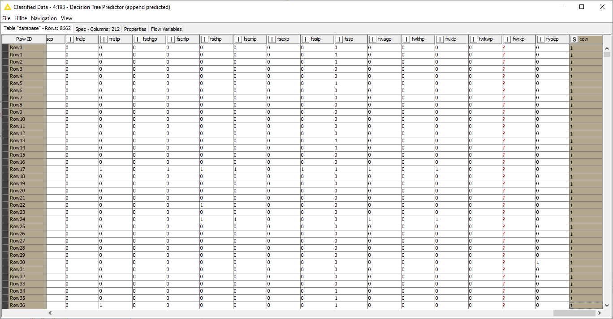

# 03_DB_Modelling Exercise
  
  Deskripsi:
  
  
  
  Untuk Main Workflownya kurang lebih seperti ini
  
  
  
### Preparation
  
  
  
  Database kita konekkan sama seperti excercise 1, lalu kita lanjut pada table selector
  
  
  
  Untuk konfigurasi pada table selector, kita pilih tablenya 05111740000055_ss13pme
  
  
  
  Selanjutnya kita tambahkan kolom filter
  
  
  
  Konfigurasi untuk kolom filter yang mempunyai prefix name PUMA* dan PWGTP* kita hilangkan (exclude)
  
  
  
### Process Modelling
  
  Selanjutnya kita tambahkan 2 row filter untuk kolom cow, untuk Cow is Not NULL dan Cow is NULL
  
  
  
  Konfigurasi Row Filter untuk Cow is NULL
  
  
  
  Lalu setelah Row Filter Cow is NULL, kita tambahkan kolom filter untuk mangapus kolom cow
  
  
  
  Setelah Row Filter Cow is Not NULL kita rubah kolom cow yang semula integer type ke dalam string type
  
  
  
  Selanjutnya pada Decision Tree Learner
  
  
  
  Konfigurasinya Seperti ini Class Kolom yang digunakan adalah kolom cow
  
  
  
  Hasil dari decision tree learner akan seperti ini
  
  
  
  Selanjutnya kita tambahkan Decision Tree predictor untuk memprediksi kolom yang akan diprediksi yaitu kolom cow
  
  
  
  Konfigurasinya Seperti ini
  
  
  
  Decision Tree Viewnya akan seperti ini
  
  
  
  Untuk kolom Cow setelah di diprediksi untuk setiap rownya, hasilnya seperti ini
  
  
  
  
