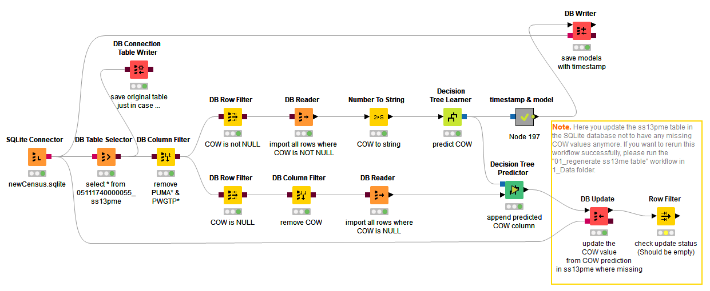
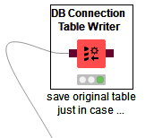
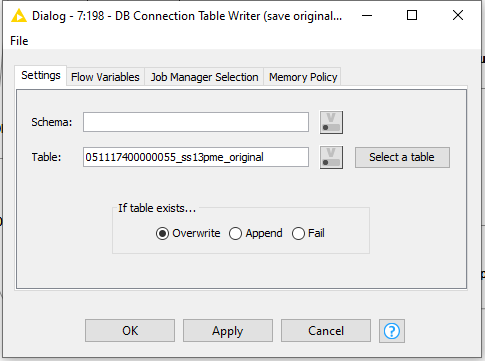
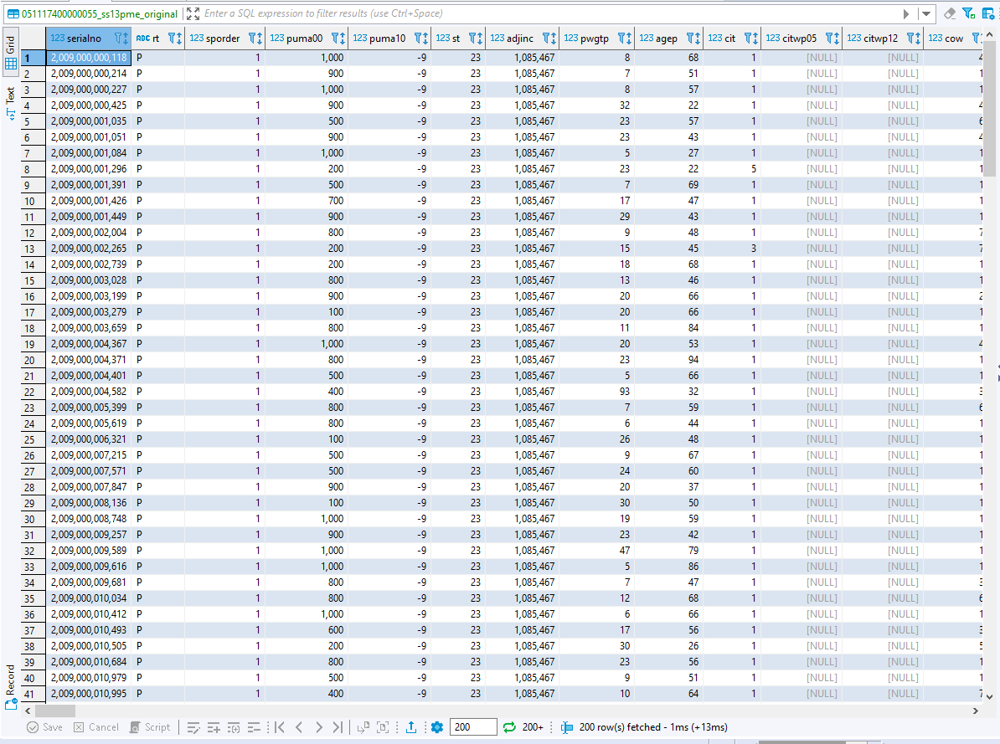
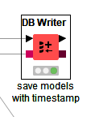
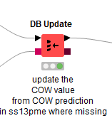

# 04_DB_WritingToDB Exercise
  
  Deskripsi:
  
  
  
  Untuk Workflownya kurang lebih seperti ini
  
  
  
  Part dari workflow yang sama dengan exercise 2
  
  
  
  Database data preparation
  
  
  
  Kita pilih table 051117740000055_ss13pme
  
  
  
  Kita tambahkan database table writer untuk menduplikasi table yang kita gunakan dan sebelum kita memanipulasinya ke dalam table 05111740000055_ss13pme_original
  
  
  
  Konfigurasinya seperti ini
  
  
  
  Setelah kita query ke Dbeaver maka akan keluar data duplikasi dari table 05111740000055_ss13pme
  
  
  
  Kita Tambahkan Tampstamp & model creator
  
  
  
  Workflownya Seperti ini
  
  
  
  lalu hasil dari workflow diatas kita masukkan ke dalam db writter
  
  
  
  Untuk konfigurasi db writternya seperti ini
  
  
  
  Hasil dapat kita lihat dengan Mengwuery table 05111740000055_model dalam Dbeaver
  
  
  
  Output dari Decision Tree Predictor Kita Masukkan kedalam DB update, dengan harapan data prediksi dari decision tree dapat kita masukkan ke dalam colom Cow dengan mengupdate datanya
  
  
  
  Dengan Konfigurasi Seperti ini
  
  
  
  Hasilnya dapat kita Lihat di dalam Dbeaver table 05111740000055_ss13pme pada kolom Cow sudah terupdate semua data pada setiap rownya dengan menggunakan data dari decision tree predictor pada tahap diatas
  
  
  
  
