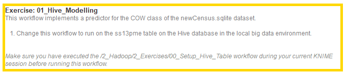
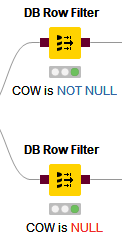
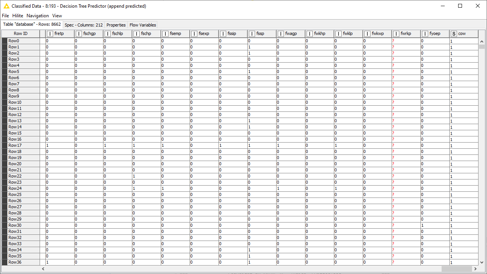

# 01_Hive_Modelling Exercise
  
  Deskripsi:
  
  
  
  Workflownya kurang lebih seperti ini
  
  
  
### Preparation
  
  
  
  Merupakan Option dari Big Data Environtment
  
  
  
  Memilih Table yang akan digunakan 05111740000055_ss13pme
  
  
  
  Memfilter kolom dalam name yang memunyai prefix name PUMA* dan PWGTP* dan akan dihilangkan
  
  
  
### Modelling

  Kita tambahkan 2 Row Filter, untuk memfilter Row COW is NULL dan COW is Not NULL
  
  
  
  Konfigurasi dari Row FIlter Untuk Cow is NOT NULL
  
  
  
  Konfigurasi dari Row FIlter Untuk Cow is NULL
  
  
  
  Selanjutnya setelah Row FIlter Cow is NULL kita Tambahkan Kolom Filter untuk menghilangkan Kolom Cow
  
  
  
  Selanjutnya setelah Row Filter Cow is NOT NULL kita merubah kolom cow yang awalnya integer type kita rubah ke string type
  
  
  
  Tambahkan Decision Tree Learner setelah step diatas
  
  
  
  Konfigurasi dati Decision Tree Learner
  
  
  
  Hasil dari Decision Tree Learner view 
  
  
  
  Step Terakhir kita Tambahkan Decision Predictor
  
  
  
  Konfigurasi dari Decision Tree Predictor
  
  
  
  Hasil dari Decision Tree Predictor view 
  
  
  
  Table View dari decision tree predictor, dan mengubah data kolom Cow semuanya sesuai dengan Data dari Decision Tree Predictor
  
  
  
