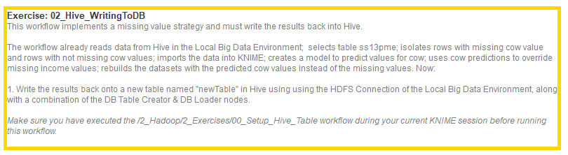
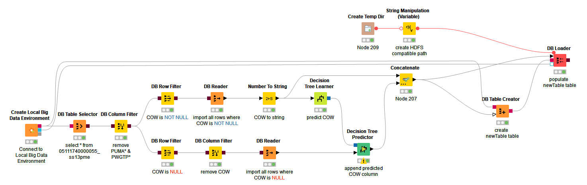
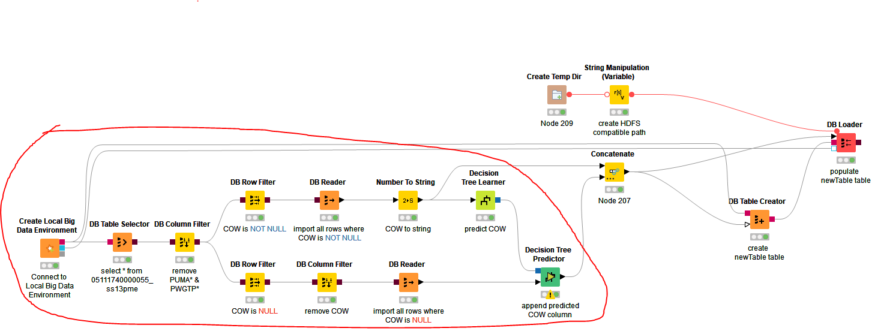
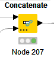
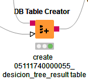
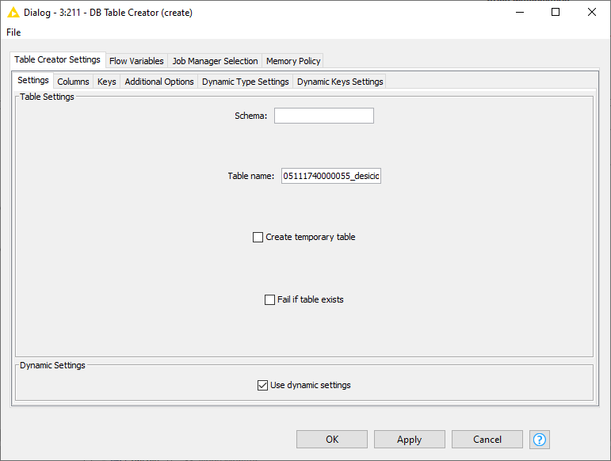
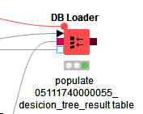
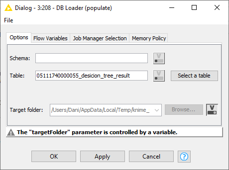
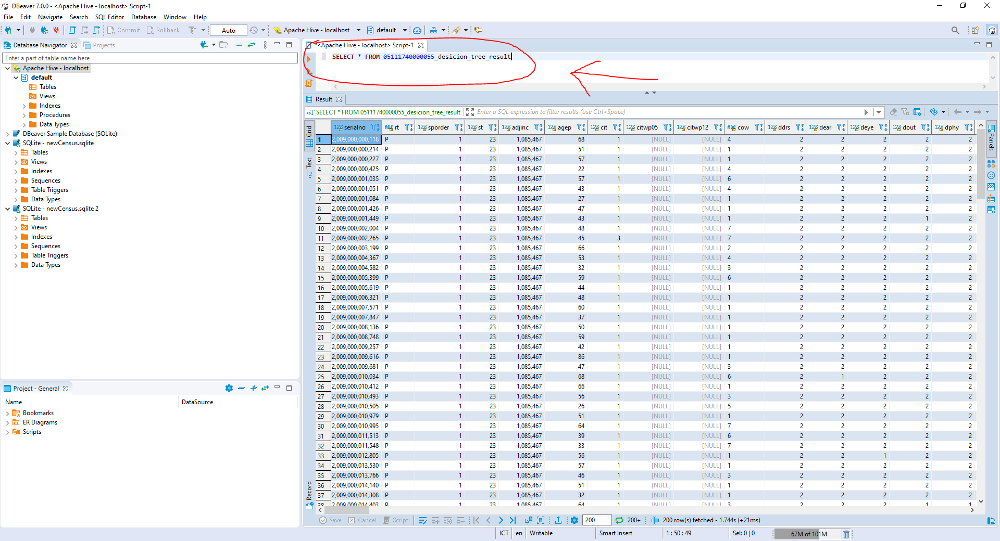

# 02_Hive_WritingToDB Exercise
  
  Deskripsi:
  
  
  
  Workflownya Kurang Lebih Seperti ini
  
  
  
  Part yang sama dari Workflow pada excercise 1
  
  
  
  Kita tambahkan concenate untuk menggabungkan data dari output dbreader pertama dan data dari output decision tree predictor
  
  
  
  Lalu kita tambahkan table creator
  
  
  
  Selanjutnya kita Konfigurasi table Creator dengan table nema 05111740000055_decision_tree_result_table
  
  
  
  lalu kita tambahkan dbloader
  
  
  
  Konfigurasi DBloader kita pilih table sesuai dengan nama table yang kita buat tadi di table creator
  
  
  
  Hasilnya dapat kita lihat dengan mengquery Dbeaver sama seperti gambar dibawah
  
  
  
  
