# Movie Recommendations with Spark Collaborative Filtering
Dokumentasi resmi KNIME : [Link here](https://www.knime.com/blog/movie-recommendations-with-spark-collaborative-filtering)

## 1. Overview

- Knime Workflow

- Movie Recomendations
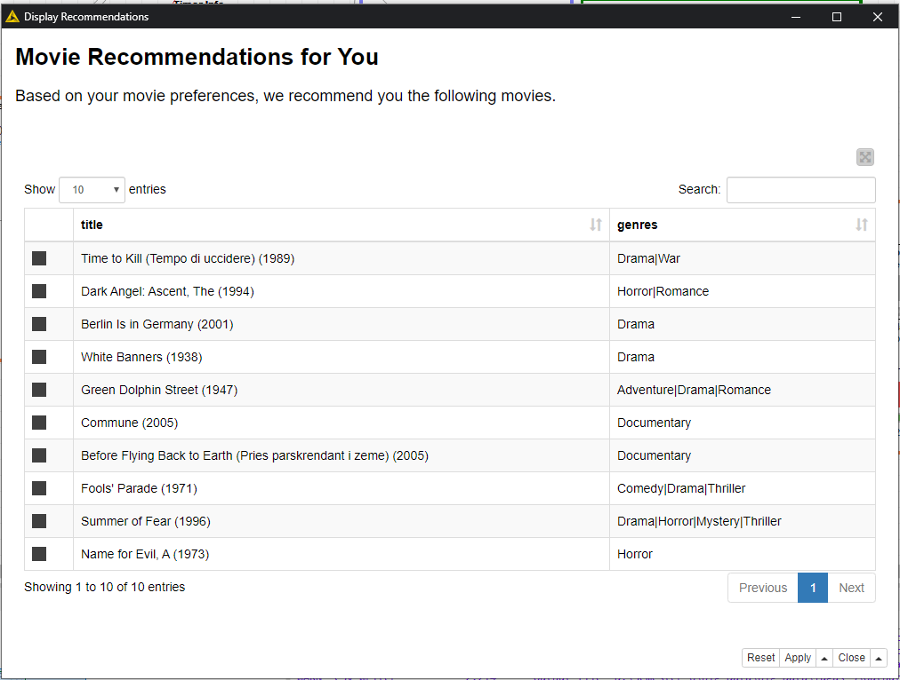

- CSV Export Movie Recomendations
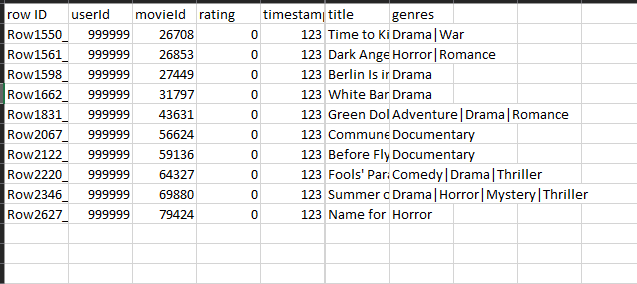

## 2. Crisp-DM Documentation

### - Business Understanding
Collaborative Filtering adalah algoritma berbasis alternating least squares (ALS) yang digunakan untuk membuat sistem rekomendasi untuk user yang didasarkan pada data-data user lain yang memiliki pola yang mirip.
Pada kali ini kita akan mencoba membuat rekomendasi film bagi user film dengan menggunakan Collaborative Filtering. Dengan cara mempredikisi setiap data film yang terbagus untuk diambil top 10 untuk dijadikan rekomendasi

### - Data Understanding
Dataset yang kita gunakan adalah dataset bawaan dari knime workflow yaitu movies.csv dan rating.csv. 

1. ratings.csv Dataset ratings.csv memiliki 20 juta data rating movie dari 130 ribu user circa yang memiliki 4 kolom dengan keterangan :
    - movieID : id dari film
    - userID : id dari user yang telah merating
    - rating : nilai rating film
    - timestamp : waktu user menginputkan data rating

2. movies.csv Dataset ini memiliki 27 ribu film dari circa yang memiliki 3 kolom dengan keterangan :
    - movieID : id dari film
    - rating : nilai rating film
    - genre  :  Kategori  film

### - Data Preparation
Awalnya kita akan memberikan id sebuah user misal : 9999 yang akan kita berikan rekomendasi film. Kita akan membuat tabel list movie yang berisikan sudah ditambahkan data user dan timestamp.

Selanjutnya kita akan meminta user memberikan rating kepada 20 film random yang kita pilih. Dengan ketentuan nilai :
- -1 = film belum ditonton
- 0 - 5 = film jelek - film bagus

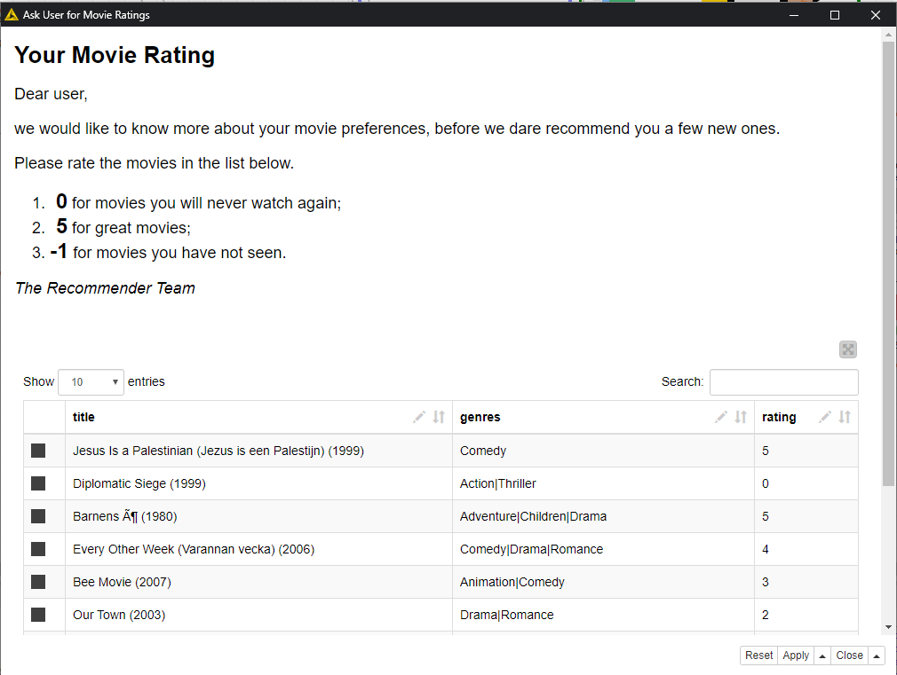

Jika user memberikan nilai -1 maka kita tidak akan menggunakan data untuk keperluan training rekomendasi.

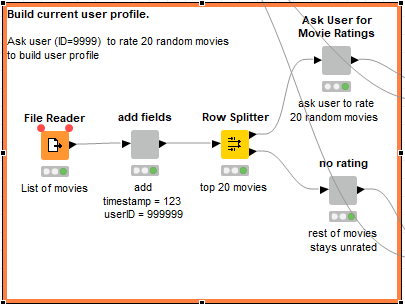

### - Modelling
Pada tahap ini kita akan membuat modeling yang akan digunakan sebagai dasar rekomendasi. Collaborative Filtering diimplementasikan dalam node Spark Collaborative Filtering Learner. Node menerima input jumlah data, dan fitur-fitur dalam datanya. Dan menghasilkan output model rekomendasi dan prediksi rating untuk semua baris data input. Dataset akan dipecah menjadi data tes dan data training, dimana data training akan digunakan untuk membangun rekomendasi dengan node Spark Collaborative Filtering Learner.

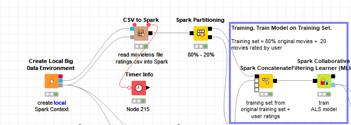

Langkah - langkah modelling :
1. Create Local Big Data Environment > Membuat semua fungsi local big data environment diantaranya Apache Hive, Apache Spark dan HDFS.
2. CSV to Spark > Membuat spark DataFrame/RDD dari csv yang kita berikan
3. Spark Partitioning > Membagi data menjadi data training dan data test 
4. Table to Spark > Membuat Spark DataFrame/RDD dari table knime. Node ini akan mengubah inputan user menjadi Dataframe/RDD Spark
5. Spark Concatenate > Menggabungkan DataFrame/RDD Spark. Pada node ini inputan user dan partisi data spark akan digabung menjadi satu tabel
6. Spark Collaborative Filtering Learner (MLlib) > Node apache spark untuk melakukan Collaborative Filtering.

Selesai langkah diatas akan dihasilkan model rekomendasi film yang siap diuji cobakan

### - Evaluation
Proses selanjutnya kita akan mengevaluasi apakah modeling sudah memberikan hasil yang baik. Data tes yang telah dipartisi akan digunakan untuk mengevaluasi kulaitas dengan node Spark Predictor dan node Spark Numeric Scorer.

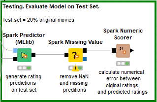

Langkah-langkah evaluasi :
1. Spark Predictor (MLlib) > Memprediksi value berdasarkan model yang telah dibuat pada proses modelling
2. Spark Missing Value > Untuk menghandle jika terdapat prediksi yang error atau membenarkan value data
3. Spark Numeric Scorer > Menghitung score antara value numerik dan value prediksi

Jika value sudah mendekati, maka model sudah benar dan siap untuk digunakan sebagai model rekomendasi

### - Deployment
Model yang sudah dievaluasi akan digunakan sebagai prediksi dalam film-film lainya yang belum dirating oleh user. Dengan menggunakan Spark Predictor kita akan memprediksi semua film tersebut dan mengambil 10 film dengan nilai rating tertinggi.

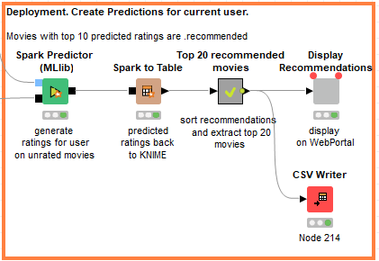
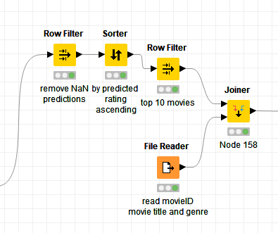

Langkah-langkah deployment :
1. Spark Predictor > Menggabungkan model yang telah dibuat untuk memprediksi rating film yang belum dirating
2. Spark to Table > Mengubah kembali bentuk spark RRD menjadi knime table
3. Row filter > Memfilter nilai nan jika terjadi kesalahan prediksi
4. Sorter > Mengurutkan data dari nilai prediksi tinggi ke rendah
5. Row Filter > Mengambil 10 film dengan nilai rekomendasi tertinggi
6. File reader > Mengambil data film dari file movies.csv
7. Joiner > Menggabungkan data movies dan hasil rekomendasi user
8. Display Reccomendation > Menampilkan hasil rekomendasi kepada user

9. Jika ingin output csv maka anda dapat menambahkan node csv writer untuk menyimpan tabel rekomendasi kedalam file csv

## 3. Perbandingan File Reader dan CSV to Spark 
Untuk membandingan kecepatan antara File Reader dan CSV to Spark pada knime kita membutuhkan tambahan komponen yaitu Timer info dan kita harus menggunakan dataset yang sama. Timer info ini berfungsi untuk melihat semua time execution pada Knime Workflow menggunakan variable plots, untuk implementasinya seperti ini

- File Reader

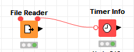

Setting dataset menggunakan rating.csv

- CSV to Spark

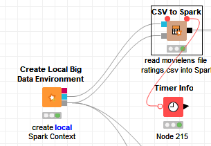

Setting dataset menggunakan rating.csv

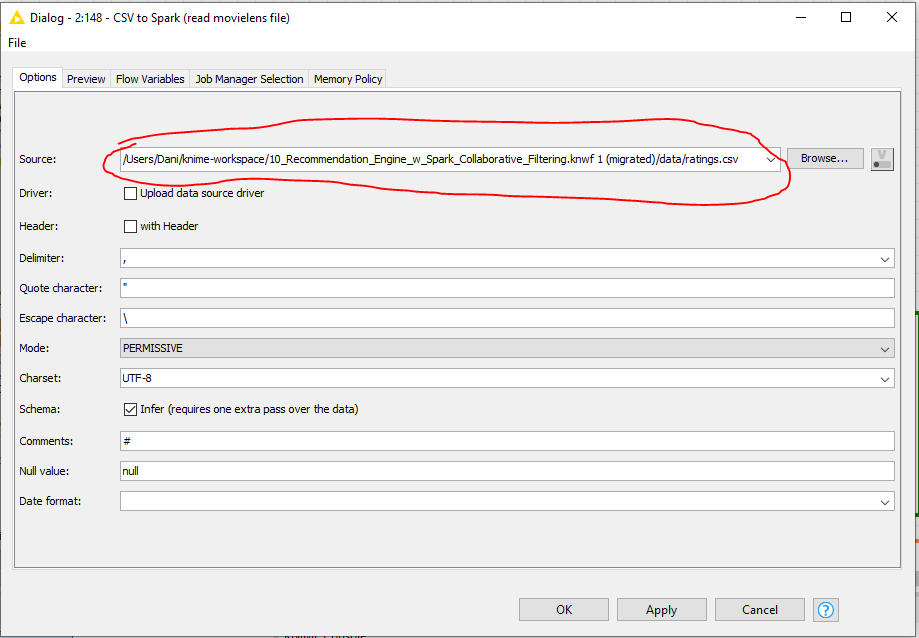

Untuk hasil perbandingannya kita dapat melihat di Output Table pada Timer Info

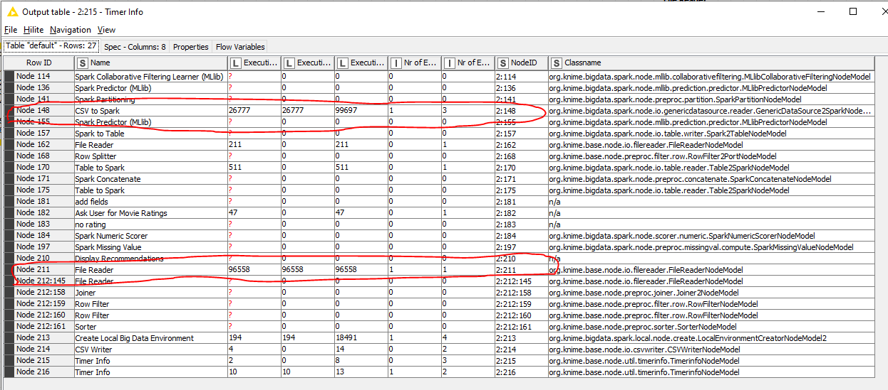

Dari hasil tersebut maka dapat kita mendapatkan data execution time :
- File Reader  : 96558 milisecond = 96.6 second
- Csv to Spark : 26777 milisecond = 26.8 second

Maka dapat disimpulkan bahwa CSV to Spark lebih cepat waktu execution timenya dibandingkan dengan File Reader untuk case dataset rating.csv

