## Big Data Genap 2019/2020
## Hendra Ramadani 05111740000055

# Implementasi Infrastruktur Kafka

## Tahap instalasi

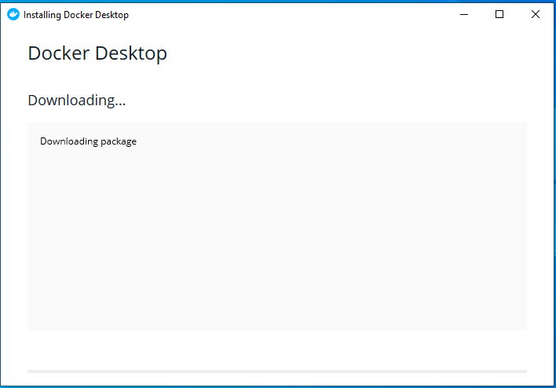
- Install Docker Desktop pada link [berikut](https://docs.docker.com/docker-for-windows/install/)
- Docker Desktop memiliki system requirements seperti berikut:
  - Windows 10 64-bit: Pro, Enterprise, or Education (Build 15063 or later).
  - Hyper-V and Containers Windows features must be enabled.

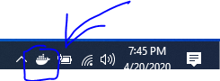
- Setelah menginstall Docker Desktop, maka ikon tersebut akan muncul pada bagian kanan taskbar


## Pembuatan infrastruktur

- Terdapat 2 cara untuk membuat infrasturktur kafka, yaitu:
  - Docker command : pembuatan step-by-step dengan mebuat container satu per satu
  - Docker compose : pembuatan menggunakan script

- Penggunaan Docker command

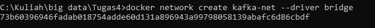
- Pertama-tama membuat docker network untuk menjalankan ZooKeeper
```
docker network create kafka-net --driver bridge
```

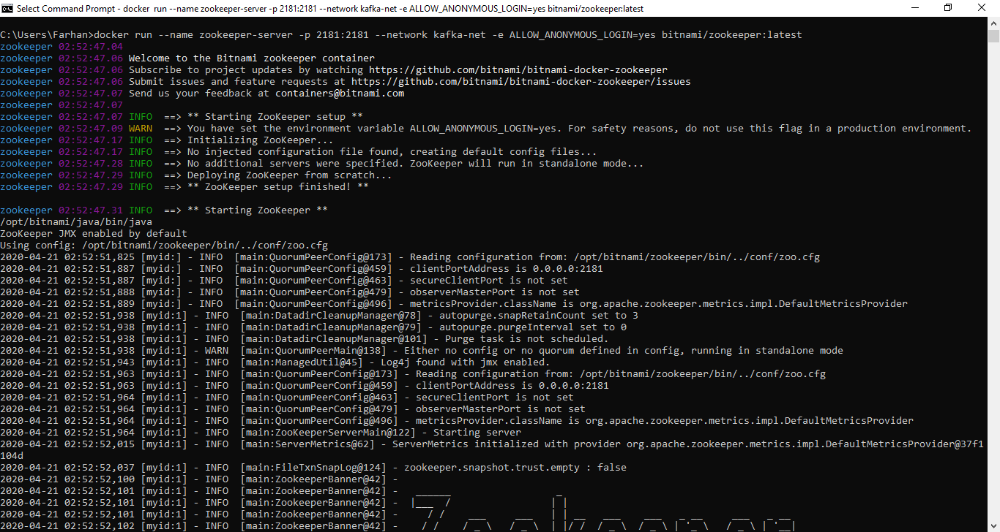
- Setelah itu jalankan container ZooKeeper dari [Bitmani ZooKeeper](https://bitnami.com/stack/zookeeper)
```
docker run --name zookeeper-server -p 2181:2181 --network kafka-net -e ALLOW_ANONYMOUS_LOGIN=yes bitnami/zookeeper:latest
```
- ZooKeeper disini berfungsi sebagai cluster manager
- Untuk bagian ALLOW_ANONYMOUS_LOGIN dibuat setting yes untuk memudahkan mengakses ZooKeeper, untuk penggunaan yang lebih professional tidak dianjurkan

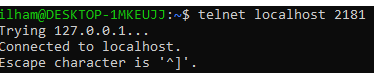
- ZooKeeper dijalankan pada port 2181, cek konektivitas menggunakan telnet

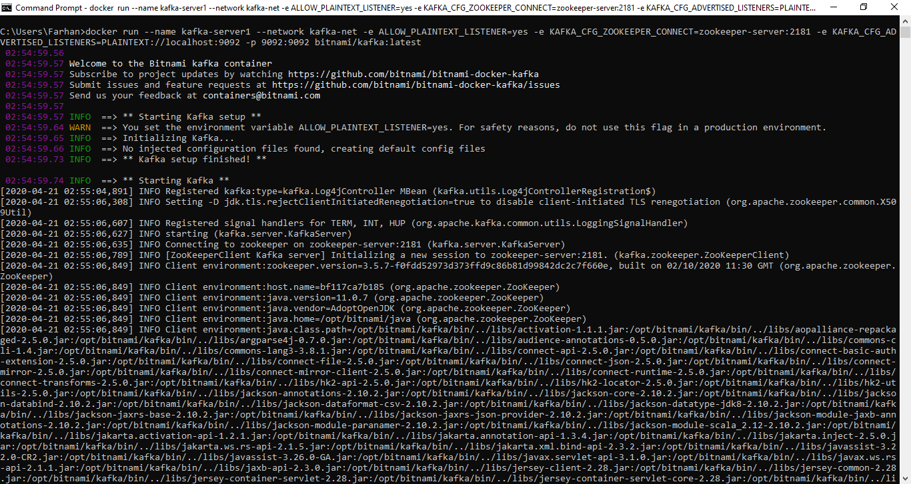
- Setelah ZooKeeper berhasil dijalankan, kemudian saatnya untuk menjalankan Kafka server
```
docker run --name kafka-server1 --network kafka-net -e ALLOW_PLAINTEXT_LISTENER=yes -e KAFKA_CFG_ZOOKEEPER_CONNECT=zookeeper-server:2181 -e KAFKA_CFG_ADVERTISED_LISTENERS=PLAINTEXT://localhost:9092 -p 9092:9092 bitnami/kafka:latest
```

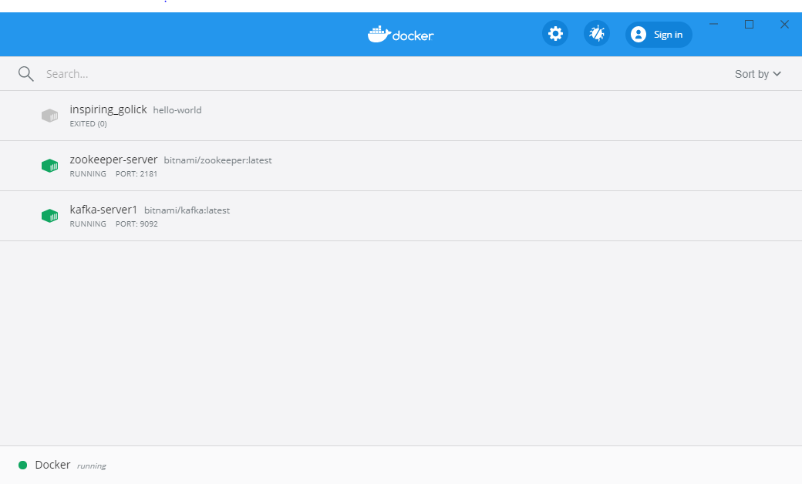
- Infrastuktur kafka telah berhasil dibuat


## Testing konektivitas

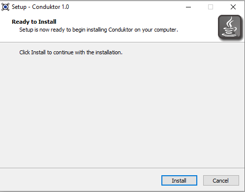
- Pertama lakukan instalasi Conduktor yang dapat diunduh [disini](https://www.conduktor.io/)
- Conduktor adalah aplikasi Kafka berbasis desktop (GUI) yang sangat simple

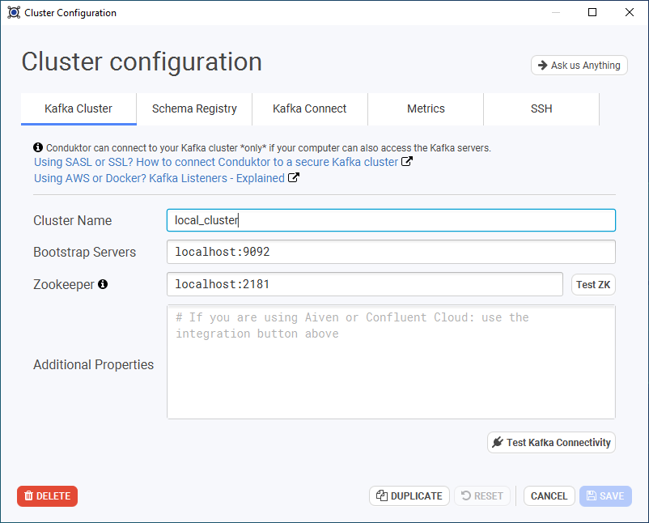
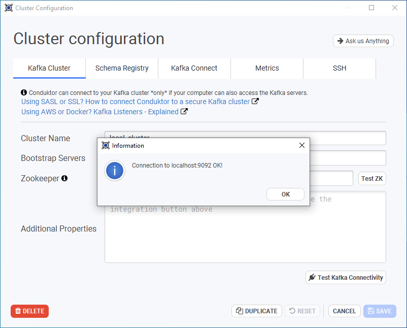
- Setelah selesai instalasi, tambahkan Kafka cluster dengan settingan yang disesuaikan pada infrastruktur Kafka yang telah dibuat diatas

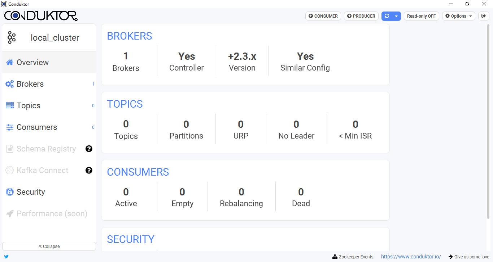
- Hasil dari test konektivitas dimana masih membuat 1 Kafka server (broker)

## Catatan

- Untuk tambahan pembuatan broker dapat menggunakan command seperti diatas, dengan memberi nama yang berbeda
```
docker run --name kafka-server2 --network kafka-net -e ALLOW_PLAINTEXT_LISTENER=yes -e KAFKA_CFG_ZOOKEEPER_CONNECT=zookeeper-server:2181 -e KAFKA_CFG_ADVERTISED_LISTENERS=PLAINTEXT://localhost:9092 -p 9092:9092 bitnami/kafka:latest
```

- Untuk pembuatan infrastruktur menggunakan Docker compose, cukup hanya membuat script bernama ``docker-compose.yml`` yang berisi:
```
version: '2.1'

networks:
  kafka-net:
    driver: bridge

services:
  zookeeper-server:
    image: 'bitnami/zookeeper:latest'
    networks:
      - kafka-net
    ports:
      - '2181:2181'
    environment:
      - ALLOW_ANONYMOUS_LOGIN=yes
  kafka-server1:
    image: 'bitnami/kafka:latest'
    networks:
      - kafka-net    
    ports:
      - '9092:9092'
    environment:
      - KAFKA_CFG_ZOOKEEPER_CONNECT=zookeeper-server:2181
      - KAFKA_CFG_ADVERTISED_LISTENERS=PLAINTEXT://localhost:9092
      - ALLOW_PLAINTEXT_LISTENER=yes
    depends_on:
      - zookeeper-server
  kafka-server2:
    image: 'bitnami/kafka:latest'
    networks:
      - kafka-net    
    ports:
      - '9093:9092'
    environment:
      - KAFKA_CFG_ZOOKEEPER_CONNECT=zookeeper-server:2181
      - KAFKA_CFG_ADVERTISED_LISTENERS=PLAINTEXT://localhost:9093
      - ALLOW_PLAINTEXT_LISTENER=yes
    depends_on:
      - zookeeper-server
```
- Setelah membuat script tersebut, lakukan command seperti berikut pada cmd di direktori script:
```
docker-compose up -d
```
- Maka docker akan secara langsung membuat infrastruktur tersebut
