# Knime : Mass Learning Event Prediction MLlib to PMML
## Hendra Ramadani (05111740000055)

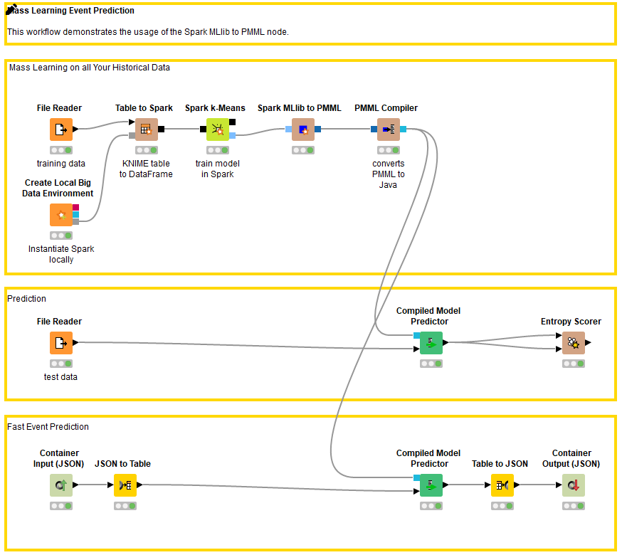

### Business Understanding
Pada workflow ini kita menggunakan dataset iris, proses yang mungkin dapat dilakukan dengan dataset ini antara lain:
- Mengklasifikasi jenis bunga iris 
- Percobaan proses mining

### Data Understanding
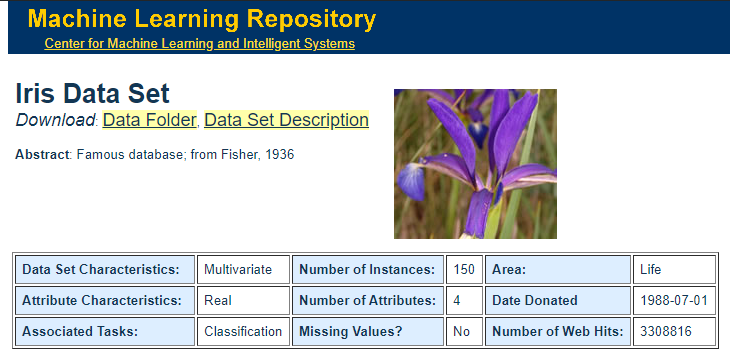

Dataset Iris merupakan dataset yang paling terkenal di seluruh dunia yang dibuat oleh R.A. Fisher, karena dataset ini biasa digunakan dalam proses pembelajaran seputar machine learning. Dataset ini isinya tentang 3 macam spesies bunga iris beserta ukuran petal dan sepal.

Atribut dari dataset iris:
1. sepal length in cm
2. sepal width in cm
3. petal length in cm
4. petal width in cm
5. class:
    - Iris Setosa
    - Iris Versicolour
    - Iris Virginica

### Data Preparation
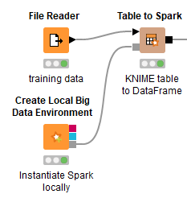

Untuk membaca dataset Iris disini menggunakan _File Reader_, Lalu untuk membuat Local Spark disini Menggunakan _Create Local Big Data Environtment_, Setelah keduanya siap antara Dataset yang dibaca dan Local Spark lalu disini dihubungkan ke _Table to Spark_ untuk mentransfer data dari File Reader Ke dalam dataframe Spark.

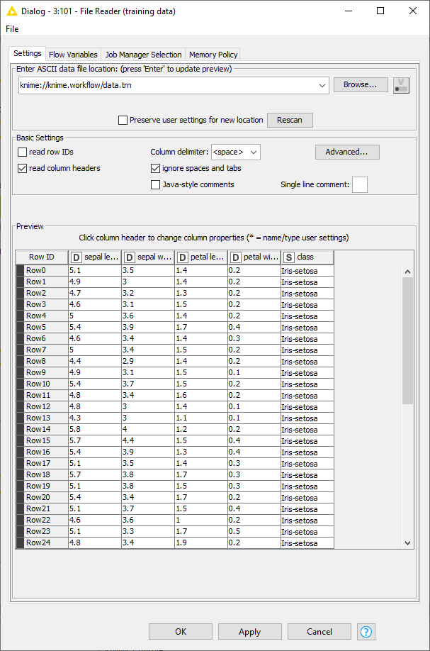

Ini merupakan default configuration _File Reader_ dari workflow tersebut
Disitu path yang digunakan untuk memanggil dataset iris

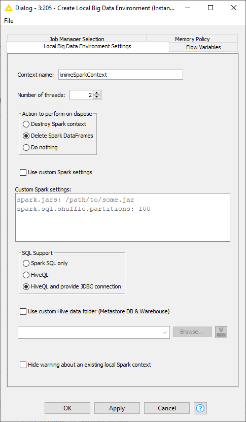

Ini merupakan default configuration _Create Local Big Data Environtment_ dari workflow tersebut

Untuk _Table to Spark_ tidak ada konfigurasi khusus

### Modelling
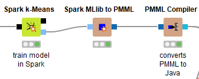

Menambahkan node _Spark k-Means_ untuk mentraining model ke dalam spark, di node ini kita rubah konfigurasinya dan kita tambahkan 4 variabel utama dari dataset iris yaitu sepal length, sepal width, petal length dan petal width, untuk konfigurasinya kurang lebih seperti ini

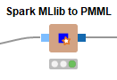

lalu kita tambahkan node _Spark MLlib to PMML_ yang digunakan untuk merubah model dari spark menjadi PMML model
Untuk Konfigurasinya kita gunakan settingan default

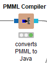

lalu kita tambahkan _PMML Compiler_ yang digunakan untuk mengkompile PMML model ke dalam Java, output dari node ini akan disambungkan ke node _Compiled Model Predictor_

### Evaluation
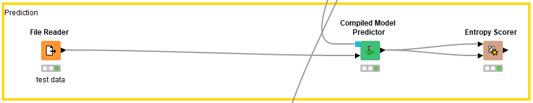

Untuk evaluasi , pertama kita butuh membaca dataset iris dengan menggunakan _File Reader_ yang path nya diarahkan ke file dataset Iris, lalu menambahkan node _Compiled Model Predictor_ yang digunakan untuk memprediksi, setelah itu menambahkan node _Entropy Scoreer_ yang digunakan untuk menghitung nilai entropy dan memberikan nilai score dari prediksi tersebut

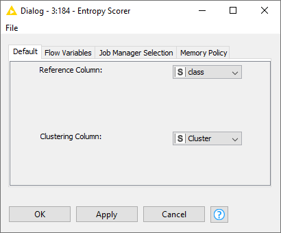

Untuk Konfigurasinya dirubah sperti ini

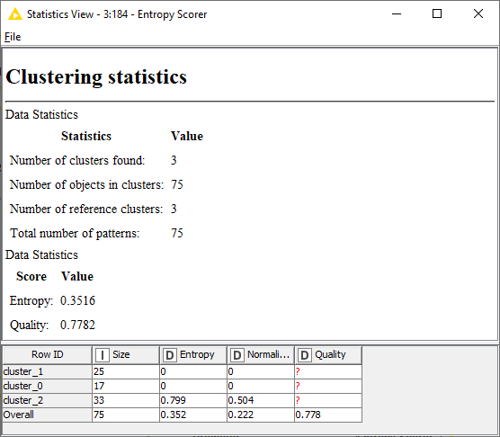

setelah node _Entropy Scorer_ kita jalankan maka kita dapat melihat hasilnya sperti ini, dari hasil clustering statistics tersebut kita mendapatkan entropy score : 0.3516 dan quality score : 0.7782

### Deployment
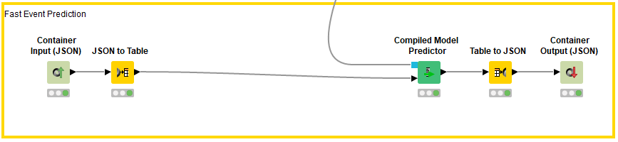

- Untuk deployment, pertama-tama memasukkan inputan JSON variabel bunga Iris yang ingin diklasifikasi dengan menambahkan node **Container Input (JSON)**
- Lalu menambahkan node **JSON to Table** untuk mengubah input JSON menjadi tabel multi kolom
- Kemudian menambahkan node **Compiled Model Predictor** untuk membuat prediction
- Setelah itu menambahkan node **Table to JSON** untuk mengubah kembali tabel multi kolom ke bentuk JSON
- Terakhir, menambahkan node **Container Output (JSON)** untuk memperlihatkan output JSON cluster dari bunga Iris yang dimasukkan pada input

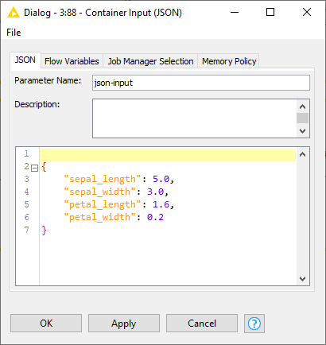

Untuk konfigurasi node _Container Input (JSON)_ , kita rubah dengan memasukkan 4 variabel atribut dari dataset Iris

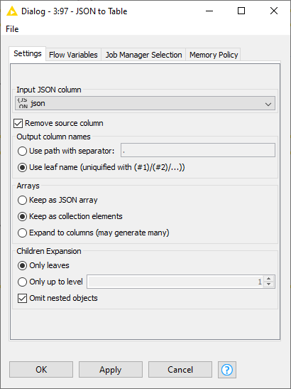

Untuk Konfigurasi node _JSON to Table_

Untuk Konfigurasi node _Compiled Model Predictor_ menggunakan settingan default

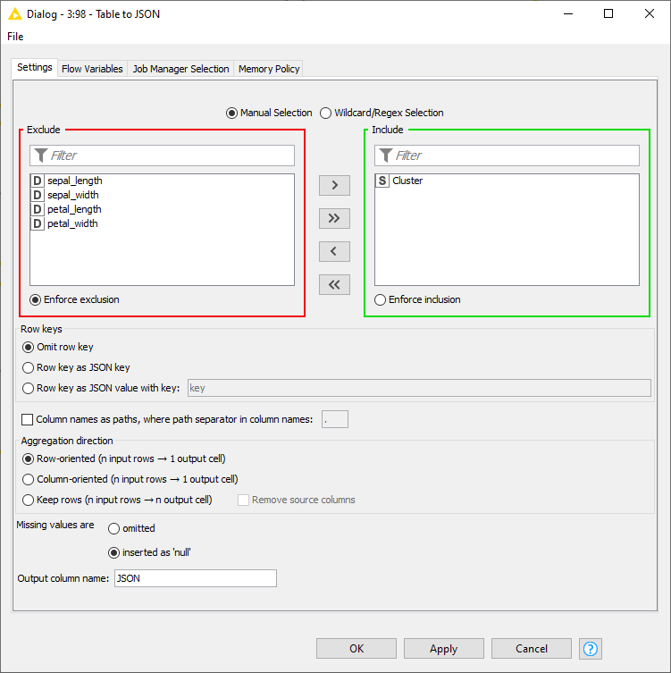

Untuk Konfigurasi node _Table to JSON_

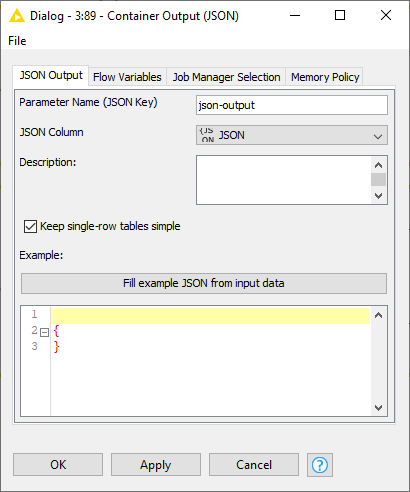

Untuk Konfigurasi _Container Output (JSON)_

Setelah kita run node _Container Output (JSON)_ , kita mendapatkan hasil JSON snapshot yang berisi JSON Cluster

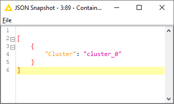