# Knime : PMML to Spark Comprehensive Mode Learning Mass Prediction
## Hendra Ramadani (05111740000055)

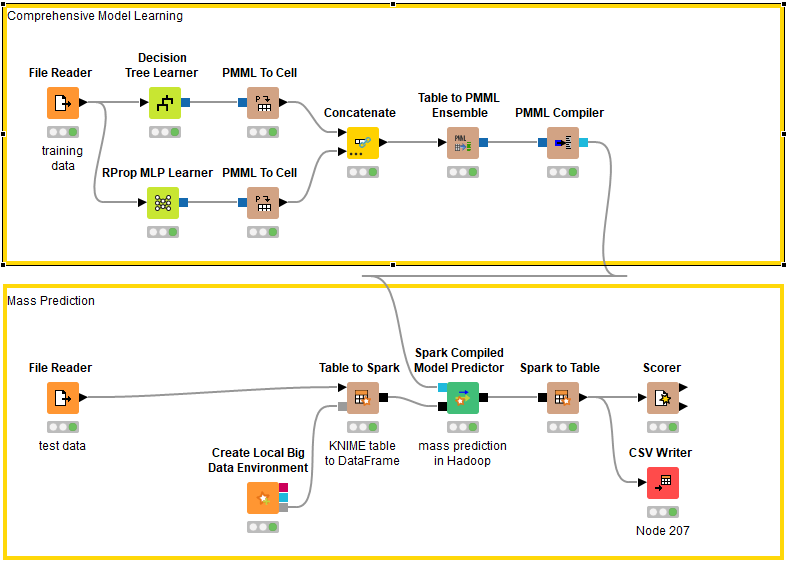

### Business Understanding
Pada workflow ini kita menggunakan dataset iris, proses yang mungkin dapat dilakukan dengan dataset ini antara lain:
    - Mengklasifikasi jenis bunga iris 
    - Percobaan proses mining

### Data Understanding

Dataset Iris merupakan dataset yang paling terkenal di seluruh dunia yang dibuat oleh R.A. Fisher, karena dataset ini biasa digunakan dalam proses pembelajaran seputar machine learning. Dataset ini isinya tentang 3 macam spesies bunga iris beserta ukuran petal dan sepal.

Atribut dari dataset iris:
1. sepal length in cm
2. sepal width in cm
3. petal length in cm
4. petal width in cm
5. class:
    - Iris Setosa
    - Iris Versicolour
    - Iris Virginica

### Data Preparation
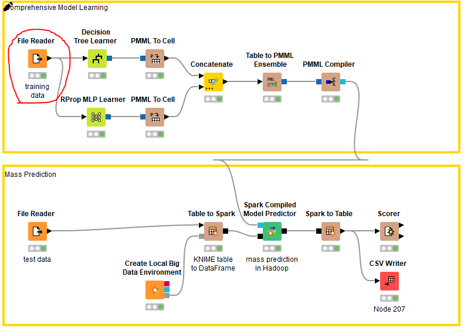

Konfigurasinya

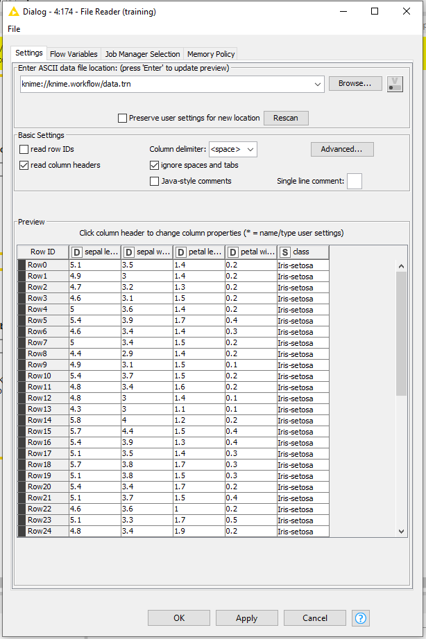

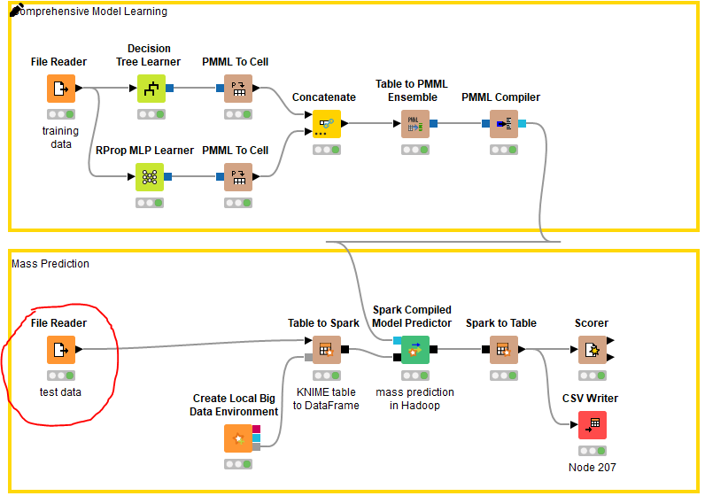

Konfigurasinya

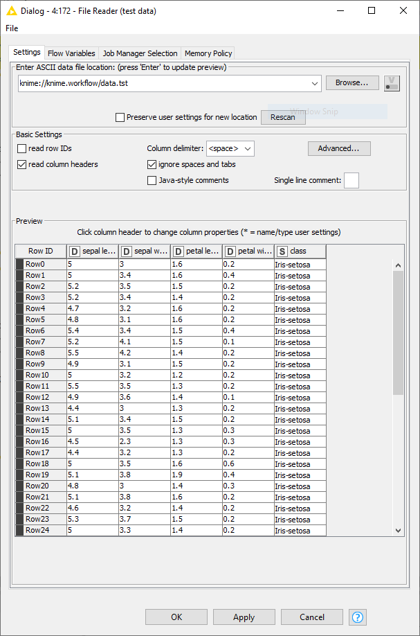

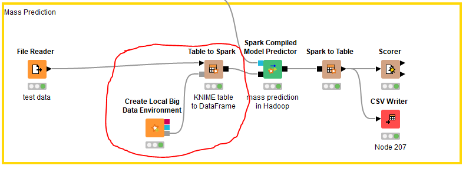

Untuk merubah data yang dibaca dari _File Reader_ kedalam spark Model

### Modelling
Pada tahap ini, kita akan memodelkan data training dari iris tersebut ke dalam bentuk **PMML** (Predictive Model Markup Language). PMML adalah bentuk standard untuk merepresentasikan sebuah **predictive solutions**.

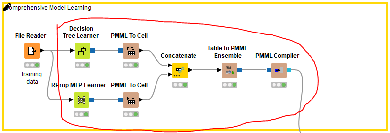

Pada proses modelling ini tidak menggunakan Spark. Di sini digunakan dua algoritma yaitu **Decision Tree Learner** dan **RProp MLP Learner**.

Decision Tree adalah algoritma pengambilan keputusan menggunakan struktur data Tree (pohon). Berikut konfigurasi dan hasilnya.

Pada konfigurasi, kolom yang digunakan sebagai output adalah **class**, metode perhitungan menggunakan **Gini Index**,  dan tidak menggunakan **Pruning Method**.

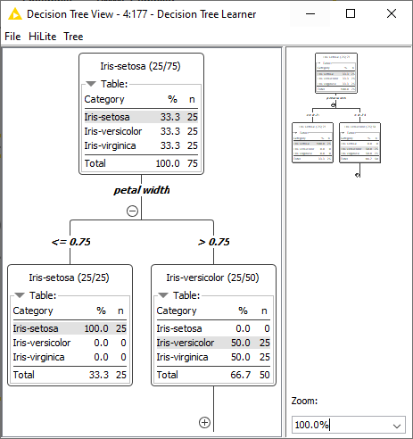

RProp MLP adalah algoritma berbasis NN (Neural Network) yang juga digunakan sebagai pengambilan keputusan. Berikut adalah konfigurasi dan hasil error plotnya.

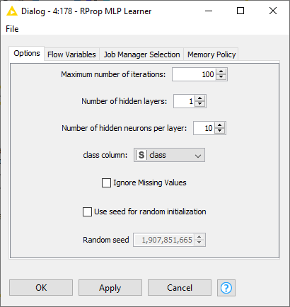

Pada konfigurasi, jumlah iterasi maksimal adalah 100, jumlah hidden layers sebanyak 1, dan jumlah dari neuron per layer adalah 10. Kolom yang digunakan sebagai output adalah **class**.

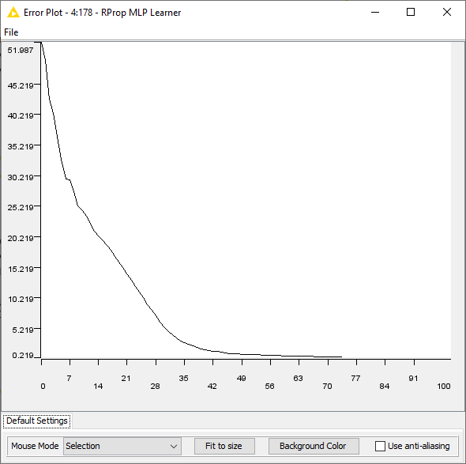

Algoritma RProp MLP di sini digunakan sebagai optimalisasi dari algoritma Decision Tree. 

Setelah proses dari kedua algoritma tersebut selesai, maka hasilnya semula berupa PMML akan diubah ke Cell, karena nantinya akan digabung. Proses konversi tersebut menggunakan node **PMML to Cell**.

Setelah itu, Hasilnya akan digabung (di-concatenate) menggunakan node **Concatenate**.

Lalu proses selanjutnya adalah mengkonversi kembali bentuk data yang semula Table menjadi PMML menggunakan node **Table to PMML Ensemble**. Agar data dalam bentuk PMML tadi dapat di compile, maka akan dikonversi ke  **Java**  menggunakan node  **PMML Compiler**.

Hasil dari node  **PMML Compiler**  nantinya akan digunakan sebagai  **Predictor** .

### Evaluation
Untuk Tahap evaluasi kita menggunakan data testing untuk mengevaluasi hasil training yang sudah kita lakukan sebelumnya
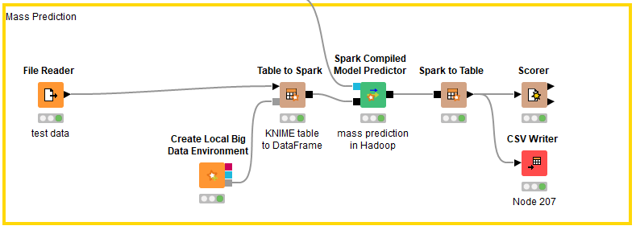

Data testing akan diproses menggunakan Spark. Oleh karena itu dibutuhkan node Create Local Big Data Environment untuk membuat instance Big Data secara Local.Data testing diubah formatnya menjadi Spark menggunakan node Table to Spark. Lalu, data Spark akan diproses dengan hasil dari node PMML Compiler sebelumnya menggunakan node Spark Compiled Model Predictor. Lalu, data akan dikembalikan lagi formatnya menjadi table menggunakan node Spark to Table agar dapat dilakukan scoring (evaluasi).

Setelah itu, data akan dievaluasi menggunakan node Scorer. Berikut ini hasilnya.
Hasil yang didapat dalam confusion Matrix kita mendapatkan accuracy sebesar 94%

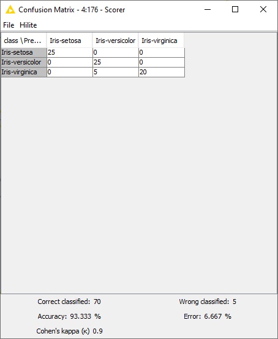

### Deployment
Pada tahap deploy ment saya menambahkan node _CSV Writer_ Karena pada worflow tidak ada node yang digunakan untuk deployment hasil, dan hasilnya seperti ini

