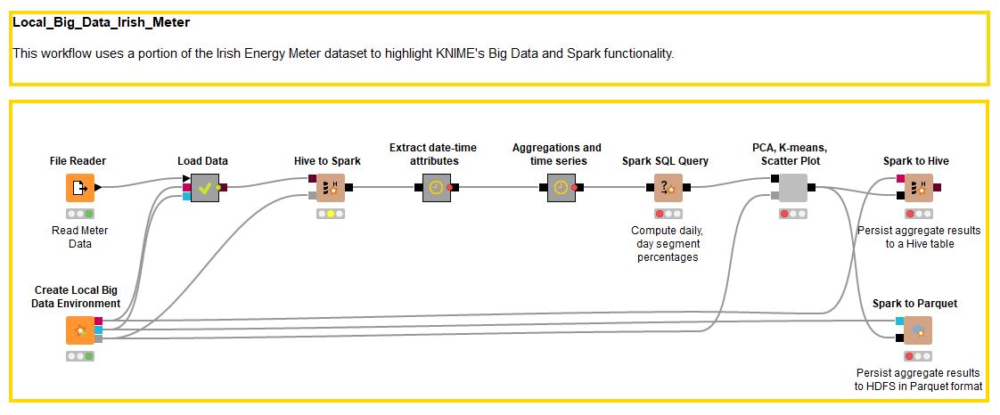
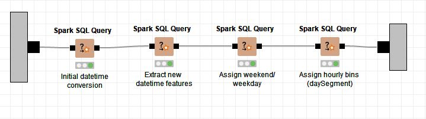
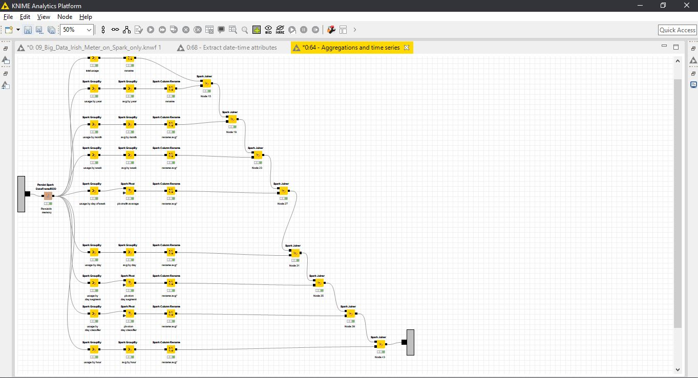
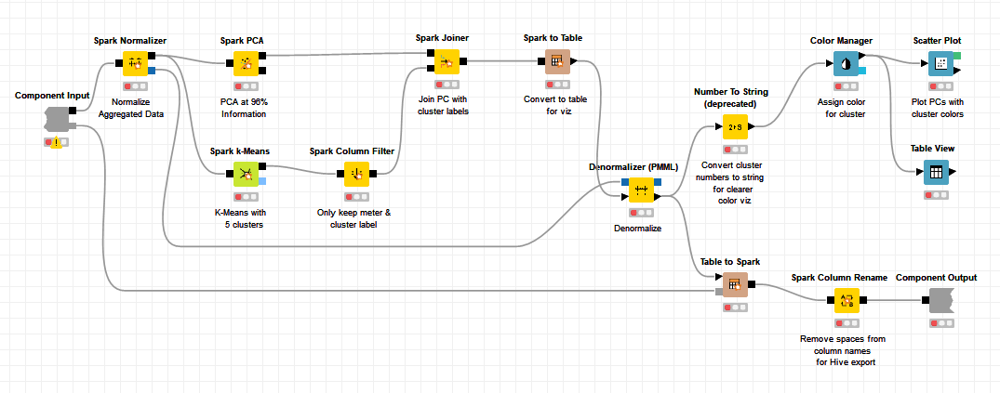
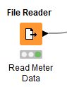
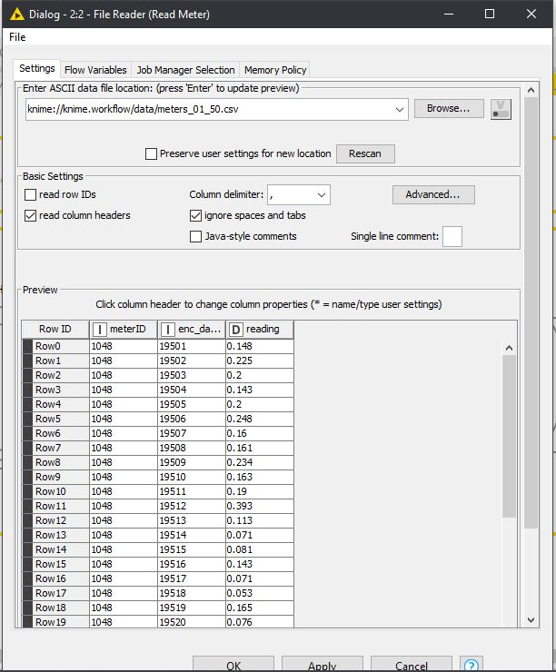
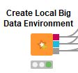
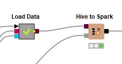
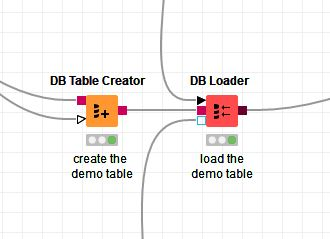

# Tugas 7
## KNIME : Big Data Irish Meter on Spark Only
Menganalisis Time Series Penggunaan listrik di Irlandia

**Worflow KNIME**

**Extract date-time Attributes**

**Aggregation and Time Series**

**PCA, K-means, Scatter Plot**

## 1. Business Understanding
Beberapa proses yang mungkin dapat dilakukan oleh datasets tersebut antara lain:

Menganalisis kebutuhan Listrik di Irlandia pada jangka waktu tertentu (Time Series) dengan mempertimbangkan beberapa variable berikut
- **Total Usage**: Penggunaan Listrik Total.
-  **Usage by Year**: Penggunaan Listrik per Tahun.
- **Usage by Month**: Penggunaan Listrik per Bulan.
- **Usage by Week**: Penggunaan Listrik per Minggu.
- **Usage by Day of Week**: Penggunaan Listrik berdasarkan hari dalam Seminggu.
- **Usage by Day**: Penggunaan Listrik per Hari.
- **Usage by Day Segment**: Penggunaan Listrik per Hari pada periode jam tertentu.
-  **Usage by Day Classifier**: Penggunaan Listrik pada saat Weekend dan Weekday.
-  **Usage by Hour**: Penggunaan Listrik pada jam tertentu.

## 2. Data Understanding
Dataset yang digunakan terdapat 3 attribut utama

 - **meterID**: id setiap Meteran listrik
 - **enc_datetime**: enkripsi dari tanggal
 - **reading**: nilai meter yang tebaca di meteran listrik

## 3. Data Preparation

1. Read 
Untuk dataset sudah disiapkan sebelumnya `meters_01_50.csv`
Data di buka dan di baca menggunakan node **File Reader**

2. Menambahkan Bigdata Environtment
Digunakan untuk kebutuhan terkait pemrosesan data secara masal

## 4. Modeling
Karena Kebutuhan pengolahan data/ Query data maka untuk step Modeling data akan diubah menjadi format yang lain yaitu dataframe

Pertama Tama kita tambahkan node **Create Local Big Data Environment** ,karena kebutuhan penggunaan spark 

Dataset yang sebelumnya sudah diload ke **File Reader**, akan diload ke HIVE menggunakan metanode **Load Data**.
Jadi untuk dataset yang sebelumnya di baca oleh node **FIle Reader** akan di load ke dalam HIVE menggunakan meta node **Load Data** 

Di dalam metanode Load Data, terdapat 2 proses lagi, yaitu **DB Table Creator** dan **DB Loader**.
Pada node **DB Table Creator**, table HIVE diberi nama meter

Node **DB Table Creator** memerlukan 2 input, yaitu: 

 - **kotak merah** (DB Connection dimana disini menggunakan Spark HIVE)
 -  **segitiga garis hitam** (berasal dari File Reader)

Sedangkan untuk output-nya adalah kotak merah yang menandakan DB Connection yang telah berhasil dibuat.

Lalu pada node **DB Loader**, memerlukan 3 input yaitu:

 - **segitiga hitam** (berasal dari File Reader).
 - **kotak merah** (DB Connection dari DB Table Creator).
 - **kotak garis biru** (Koneksi HIVE dari node Create Local Big Data Environment).

dan 1 output, yaitu:

 - **kotak coklat** (data yang telah berbentuk HIVE).

Ketika dijalankan akan mendapat hasil seperti ini

Node **Hive to Spark** digunakan untuk mengimportkan data ke dalam bentuk dataframe

Node **Hive to Spark** memerlukan 2 input, yaitu:

 - **kotak coklat** (data dari node DB Loader yang benbentuk HIVE)
 - **kotak abu-abu** (Spark context dari node Create Local Big Data Environment)

dan 1 output, yaitu:

 - **kotak hitam** (data yang telah berbentuk DataFrame/RDD)

## 5. Evaluation
Pada proses evaluation ini, kita akan mengimplementasikan business understanding-nya.

Ada 4 proses yang harus diselesaikan, yaitu:

 - **Extract date-time attributes** (untuk mendapatkan waktu)
 - **Agreagations and time series** (agregasi penggunaan listrik berdasarkan waktu)
 - **Compute daily, day segment percentages** (menghitung persentase dari penggunaan listrik secara per hari, dan pada hari saat periode jam tertentu).
 - **Scatter Plot** (plotting hasil menggunakan algoritma K-Means).

### 1. Extract date-time attributes

#### a. Initial datetime conversion

Pada proses ini akan dibuat kolom2 baru yang berisi waktu2 dari hasi extrasi data.

Pada node **Spark SQL Query** (Initiate datetime conversion) kolom reading akan di-rename dengan nama **kw30** dan akan dibuat 2 kolom baru yaitu **eventDate** dan **my_time**. Berikut penjelasannya:

 - **eventDate**: terbentuk karena memanggil fungsi date_add (mengambil value tanggal yang dimulai pada **31-12-2008** dengan interval waktu yang diambil dari kolom **enc_datetime** dari digit pertama sampai ketiga).
 - **my_time**: mengambil value waktu (format: **hh:mm**) 
 - dimana **hh** dibentuk dari value pada kolom **enc_datetime** yang diambil digit ke-4nya. Lalu dikalikan dengan 30 dan dibagi dengan 60. Setelah itu, akan di-mod dengan 24 yang menandakan 24-jam, dan disimpan hasilnya dalam bentuk 2 digit.
 - untuk **mm**, dibentuk dari value pada kolom **enc_datetime** yang diambil digit ke-4nya. Lalu akan dikali dengan 30 dan di-mod dengan 60 yang menandakan 60 menit, dan disimpan hasilnya dalam bentuk 2 digit. 

Hasilnya adalah sebagai berikut:

#### b.  Extract new datetime features

Untuk proses ini akan dibentuk 5 kolom baru, yaitu:

 - **year**: mengambil nilai tahun dari value pada kolom eventDate.
 - **month**: mengambil nilai bulan dari value pada kolom eventDate.
 -  **week**: mengambil nilai minggu dari value pada kolom eventDate.
 - **dayOfWeek**: mengabil nilai date_format (nama hari) dari value pada kolom eventDate.
 - **hour**: mengambil nilai jam dari value pada kolom my_time.

Berikut adalah hasil query-nya.

#### c. Assign Weekend/Weekday

Pada proses ini, akan dibuat kolom **dayClassifier** untuk mengkondisikan hari. Ketika nama harinya **Saturday** atau **Sunday**, maka akan diberi value **WE** (Weekend). Selain hari itu akan diberi value **BD**.

Berikut adalah hasilnya.

#### d. Assign Hourly Bins (daySegment)

Pada proses ini, akan dibentuk 1 kolom yaitu **daySegment** dengan ketentuan isi sebagai berikut:

 - Jika nilai hour >= 7 dan hour < 9, maka nilai daySegment adalah **7-9**
 - Jika nilai hour >= 9 dan hour < 13, maka nilai daySegment adalah **9-13**
 - Jika nilai hour >= 13 dan hour < 17, maka nilai daySegment adalah **13-17**
 - Jika nilai hour >= 17 dan hour < 21, maka nilai daySegment adalah **17-21**
 - Jika nilai hour >= 21 dan hour < 7, maka nilai daySegment adalah **21-7**

Berikut adalah hasilnya.

### 2. Aggregation and Time Series

Setelah melalui proses pembuatan kolom, maka selanjutnya adalah proses agregasi data. Data akan di Filter sesuai dengan Business Understandingnya.

#### a. Total Usage

Yang pertama, adalah mencari nilai Penggunaan Listrik Total menggunakan node **Spark GroupBy**. Caranya adalah dengan melakukan penjumlahan **(SUM)** pada kolom **kw30**, lalu di Group By berdasarkan **meterID**-nya. 

Berikut adalah hasilnya:

Agar memudahkan ketika dibaca, maka perlu diubah nama kolomnya menggunakan node **Spark Column Rename**.

Nama kolom yang semula **kw30(sum)** diubah menjadi **totalKW**. Proses untuk mencari Total Usage telah selesai. Selanjutnya adalah mencari Rata-rata Usage by Year.

#### b. Usage By Year

Proses ini adalah untuk mencari nilai Rata-rata Penggunaan Listrik per Tahun menggunakan node **Spark GroupBy**. Caranya adalah dengan melakukan penjumlahan **(SUM)** pada kolom **kw30**, lalu di Group By berdasarkan **meterID**, dan **year**-nya. 

Berikut adalah hasilnya:

Setelah itu, hasilnya akan di proses ke node **Spark GroupBy** untuk mencari nilai rata-ratanya. Caranya adalah dengan melakukan agregasi Average (AVG) pada kolom sum(kw30) lalu di GroupBy berdasarkan meterID.

Berikut adalah hasilnya:

Agar memudahkan ketika dibaca, maka perlu diubah nama kolomnya menggunakan node **Spark Column Rename**.

Nama kolom yang semula **mean(sum(kw30))** diubah menjadi **avgYearlyKW**.

Proses untuk mencari nilai Rata-rata dari Penggunaan Listrik per Tahun telah selesai. 

Selanjutnya adalah melakukan Join untuk nilai Penggunaan Listrik Total dan Rata-rata Penggunaan Listrik per Tahun menggunakan node **Spark Joiner**.

Berikut adalah hasilnya:

Proses selanjutnya adalah mencari Rata-rata Penggunaan Listrik per Bulan.

#### c. Usage by Month

Proses ini adalah untuk mencari nilai Rata-rata Penggunaan Listrik per Bulan menggunakan node **Spark GroupBy**. Caranya adalah dengan melakukan penjumlahan **(SUM)** pada kolom **kw30**, lalu di Group By berdasarkan **meterID**, **year**, dan **month**-nya. 

Berikut adalah hasilnya:

Setelah itu, hasilnya akan di proses ke node **Spark GroupBy** untuk mencari nilai rata-ratanya. Caranya adalah dengan melakukan agregasi Average (AVG) pada kolom sum(kw30) lalu di GroupBy berdasarkan meterID.

Berikut hasilnya:

Agar memudahkan ketika dibaca, maka perlu diubah nama kolomnya menggunakan node **Spark Column Rename**.

Nama kolom yang semula **mean(sum(kw30))** diubah menjadi **avgMonthlyKW**.

Proses untuk mencari nilai Rata-rata dari Penggunaan Listrik per Bulan telah selesai. 

Selanjutnya adalah melakukan Join untuk Rata-rata Penggunaan Listrik per Bulan dengan hasil join sebelumnya menggunakan node **Spark Joiner**.

Berikut adalah hasilnya:

Proses selanjutnya adalah mencari biaya Penggunaan Listrik per Minggu.

#### d. Usage by Week

Proses ini adalah untuk mencari nilai Rata-rata Penggunaan Listrik per Minggu menggunakan node **Spark GroupBy**. Caranya adalah dengan melakukan penjumlahan **(SUM)** pada kolom **kw30**, lalu di Group By berdasarkan **meterID**, **year**, dan **week**-nya. 

Berikut adalah hasilnya:

Setelah itu, hasilnya akan di proses ke node **Spark GroupBy** untuk mencari nilai rata-ratanya. Caranya adalah dengan melakukan agregasi Average (AVG) pada kolom sum(kw30) lalu di GroupBy berdasarkan meterID.

Berikut adalah hasilnya:

Agar memudahkan ketika dibaca, maka perlu diubah nama kolomnya menggunakan node **Spark Column Rename**.

Nama kolom yang semula **mean(sum(kw30))** diubah menjadi **avgWeeklyKW**.

Proses untuk mencari nilai Rata-rata dari Penggunaan Listrik per Minggu telah selesai. 

Selanjutnya adalah melakukan Join untuk Rata-rata Penggunaan Listrik per Minggu dengan hasil join sebelumnya menggunakan node **Spark Joiner**.

Berikut adalah hasilnya:

Proses selanjutnya adalah mencari biaya Penggunaan Listrik berdasarkan hari dalam Seminggu.

#### e. Usage by Day of Week

Proses ini adalah untuk mencari nilai Rata-rata Penggunaan Listrik berdasarkan hari dalam Seminggu menggunakan node **Spark GroupBy**. Caranya adalah dengan melakukan penjumlahan **(SUM)** pada kolom **kw30**, lalu di Group By berdasarkan **meterID**, **year**, **week**, dan **dayOfWeek**-nya. 

Berikut adalah hasilnya:

Setelah itu, hasilnya akan di proses ke node **Spark Pivot** untuk mencari nilai rata-rata pada setiap pivot-nya (**dayOfWeek**). Caranya adalah dengan melakukan agregasi Average (AVG) pada kolom sum(kw30) lalu di GroupBy berdasarkan meterID dan pilih pivot column **dayOfWeek**.

Berikut adalah hasilnya:

Agar memudahkan ketika dibaca, maka perlu diubah nama kolomnya menggunakan node **Spark Column Rename**.

Nama kolom yang semula **[Hari] + mean(sum(kw30))** diubah menjadi **avg[Hari]**.

Proses untuk mencari nilai Rata-rata dari Penggunaan Listrik berdasarkan hari dalam Seminggu telah selesai. 

Selanjutnya adalah melakukan Join untuk Rata-rata Penggunaan Listrik berdasarkan hari dalam Seminggu dengan hasil join sebelumnya menggunakan node **Spark Joiner**.

Berikut adalah hasilnya:

Proses selanjutnya adalah mencari biaya Penggunaan Listrik per Hari.

#### f. Usage by Day

Proses ini adalah untuk mencari nilai Rata-rata Penggunaan Listrik per Hari menggunakan node **Spark GroupBy**. Caranya adalah dengan melakukan penjumlahan **(SUM)** pada kolom **kw30**, lalu di Group By berdasarkan **meterID**, dan **eventDate**-nya. 

Berikut adalah hasilnya:

Setelah itu, hasilnya akan di proses ke node **Spark GroupBy** untuk mencari nilai rata-ratanya. Caranya adalah dengan melakukan agregasi Average (AVG) pada kolom sum(kw30) lalu di GroupBy berdasarkan meterID.

Berikut adalah hasilnya:

Agar memudahkan ketika dibaca, maka perlu diubah nama kolomnya menggunakan node **Spark Column Rename**.

Nama kolom yang semula **mean(sum(kw30))** diubah menjadi **avgDaily**.

Proses untuk mencari nilai Rata-rata dari Penggunaan Listrik per Hari telah selesai. 

Selanjutnya adalah melakukan Join untuk Rata-rata Penggunaan Listrik per Hari dengan hasil join sebelumnya menggunakan node **Spark Joiner**.

Berikut adalah hasilnya:

Proses selanjutnya adalah mencari Penggunaan Listrik per Hari pada periode jam tertentu.

#### g. Usage by Day Segment

Proses ini adalah untuk mencari nilai Rata-rata Penggunaan Listrik per Hari menggunakan node **Spark GroupBy**. Caranya adalah dengan melakukan penjumlahan **(SUM)** pada kolom **kw30**, lalu di Group By berdasarkan **meterID**, **eventDate**, dan **daySegment**-nya. 

Berikut adalah hasilnya:

Setelah itu, hasilnya akan di proses ke node **Spark Pivot** untuk mencari nilai rata-rata pada setiap pivot-nya (**daySegment**). Caranya adalah dengan melakukan agregasi Average (AVG) pada kolom sum(kw30) lalu di GroupBy berdasarkan meterID dan pilih pivot column **daySegment**.

Berikut adalah hasilnya:

Agar memudahkan ketika dibaca, maka perlu diubah nama kolomnya menggunakan node **Spark Column Rename**.

Nama kolom yang semula **[daySegment] + mean(sum(kw30))** diubah menjadi **avg[daySegment]**.

Proses untuk mencari nilai Rata-rata dari Penggunaan Listrik per Hari pada periode jam tertentu telah selesai. 

Selanjutnya adalah melakukan Join untuk Rata-rata Penggunaan Listrik per Hari pada periode jam tertentu dengan hasil join sebelumnya menggunakan node **Spark Joiner**.

Berikut adalah hasilnya:

Proses selanjutnya adalah mencari Penggunaan Listrik pada saat Weekend dan Weekday.

#### h. Usage by Day Classifier

Proses ini adalah untuk mencari nilai Rata-rata Penggunaan Listrik per Hari menggunakan node **Spark GroupBy**. Caranya adalah dengan melakukan penjumlahan **(SUM)** pada kolom **kw30**, lalu di Group By berdasarkan **meterID**, **year**, **month**, **week**, dan **dayClassifier**-nya. 

Berikut adalah hasilnya:

Setelah itu, hasilnya akan di proses ke node **Spark Pivot** untuk mencari nilai rata-rata pada setiap pivot-nya (**dayClassifier**). Caranya adalah dengan melakukan agregasi Average (AVG) pada kolom sum(kw30) lalu di GroupBy berdasarkan meterID dan pilih pivot column **dayClassifier**.

Berikut adalah hasilnya:

Agar memudahkan ketika dibaca, maka perlu diubah nama kolomnya menggunakan node **Spark Column Rename**.

Nama kolom yang semula **[dayClassifier] + mean(sum(kw30))** diubah menjadi **avg[dayClassifier]**.

Proses untuk mencari nilai Rata-rata dari Penggunaan Listrik pada saat Weekend dan Weekday telah selesai. 

Selanjutnya adalah melakukan Join untuk Rata-rata Penggunaan Listrik pada saat Weekend dan Weekday dengan hasil join sebelumnya menggunakan node **Spark Joiner**.

Berikut adalah hasilnya:

Proses selanjutnya adalah mencari Penggunaan Listrik pada jam tertentu.

#### i. Usage by Hour

Proses ini adalah untuk mencari nilai Rata-rata Penggunaan Listrik per Hari menggunakan node **Spark GroupBy**. Caranya adalah dengan melakukan penjumlahan **(SUM)** pada kolom **kw30**, lalu di Group By berdasarkan **meterID**, **eventDate**, dan **hour**-nya. 

Berikut adalah hasilnya:

Setelah itu, hasilnya akan di proses ke node **Spark GroupBy** untuk mencari nilai rata-ratanya. Caranya adalah dengan melakukan agregasi Average (AVG) pada kolom sum(kw30) lalu di GroupBy berdasarkan meterID.

Berikut adalah hasilnya:

Agar memudahkan ketika dibaca, maka perlu diubah nama kolomnya menggunakan node **Spark Column Rename**.

Nama kolom yang semula **mean(sum(kw30))** diubah menjadi **avgHourly**.

Proses untuk mencari nilai Rata-rata dari Penggunaan Listrik pada jam tertentu. telah selesai. 

Selanjutnya adalah melakukan Join untuk Rata-rata Penggunaan Listrik pada jam tertentu. dengan hasil join sebelumnya menggunakan node **Spark Joiner**.

Berikut adalah hasilnya:

Proses selanjutnya adalah menghitung presentase dari penggunakan listrik per hari dan pada periode jam tertentu.

### 3. Compute daily, day segment percentages
Pada proses ini, akan dihitung persentase dari penggunaan listrik secara per hari, dan pada hari saat periode jam tertentu pada proses sebelumnya menggunakan node **Spark SQL Query**.

    
Pada Query di atas, akan dibuat 12 kolom yang merepresentasikan presentasi dari Penggunaan Listrik per hari dan pada periode jam tertentu.

Berikut adalah hasilnya:

Proses selanjutnya adalah Plotting menggunakan algoritma PCA dan K-Means.

### 4. Scatter Plot
Pada proses ini akan dilakukan plotting dari hasil perhitungan persentasi di atas menggunakan algoritma PCA, dan K-Means di node **PCA, K-Means, Scatter Plot**.

Berikut adalah hasilnya:

Proses Evaluation telah selesai.

## 6. Deployment

Untuk deployment sendiri, data dari step Evaluation akan di deploy ke dalam HIVE menggunakan **Spark to Hive** dan Parquet menggunakan **Spark to Parquet**, **Spark to Parquet** berfungsi untuk mengubah format data yang awalnya adalah **DataFrame/RDD** menjadi format **file Parquet**, Berikut merupakan konfigurasi dari **Spark to Hive** 

Tabel akan diberi nama **metricaggs**

Berikut merupakankonfigurasi untuk **Spark to Parquet**

Untuk hasilnya sendiri akan disimpan pada direktori **/meter_aggs**. 
Berikut adalah hasilnya:

