# Big Data : Evaluasi Akhir Semester
# Daily Minimum Temperature in Meter

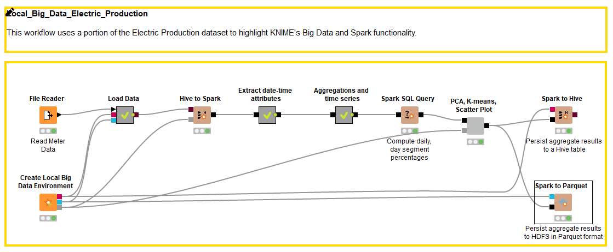

# Business Understanding
Proses yang dilakukan pada dataset yang digunakan adalah :

Menganalisis rata-rata produksi listrik pada kurun waktu tertentu (time series), dengan mempertimbangkan:
  - Total Usage: Keseluruhan Produksi Listrik dalam satuan waktu Bulan (Dikarenakan semua data unik dan tidak memiliki ID). Terdapat variable hari namun hanya 1 variasi.
  - Usage by Year: Produksi Listrik per Tahun dalam satuan waktu Bulan.

# Data Understanding
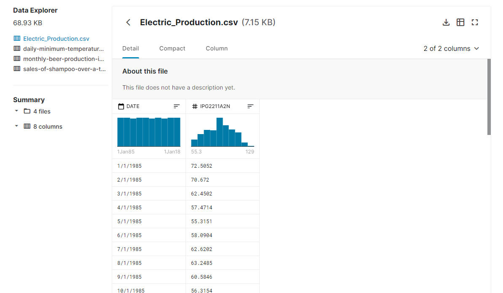

Merupakan dataset yang isinya pencatatan suhu terendah setiap hari

Dataset yang digunakan terdapat 2 attribut utama

 - **DATE**: Tanggal produksi.
 - **IPG2211A2N**: Satuan utilitas elektrik dan gas.

# Data Preparation

1. Read 
Untuk dataset sudah disiapkan sebelumnya `electric-production.csv`
Data di buka dan di baca menggunakan node **File Reader**

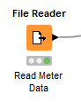

2. Menambahkan Bigdata Environtment
Digunakan untuk kebutuhan terkait pemrosesan data secara masal

# Modeling
Karena Kebutuhan pengolahan data/ Query data maka untuk step Modeling data akan diubah menjadi format yang lain yaitu dataframe

Pertama Tama kita tambahkan node **Create Local Big Data Environment** ,karena kebutuhan penggunaan spark 

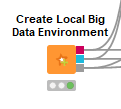

Dataset yang sebelumnya sudah diload ke **File Reader**, akan diload ke HIVE menggunakan metanode **Load Data**.
Jadi untuk dataset yang sebelumnya di baca oleh node **FIle Reader** akan di load ke dalam HIVE menggunakan meta node **Load Data** 

Di dalam metanode Load Data, terdapat 2 proses lagi, yaitu **DB Table Creator** dan **DB Loader**.
Pada node **DB Table Creator**, table HIVE diberi nama **suhu**

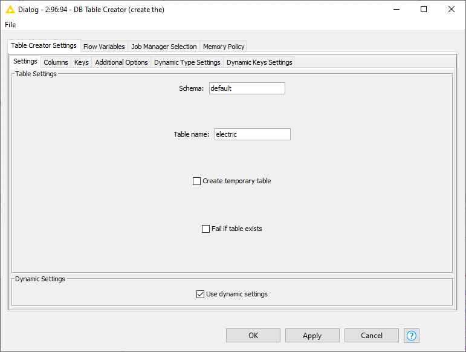

Node **DB Table Creator** memerlukan 2 input, yaitu: 

 - **kotak merah** (DB Connection dimana disini menggunakan Spark HIVE)
 -  **segitiga garis hitam** (berasal dari File Reader)

Sedangkan untuk output-nya adalah kotak merah yang menandakan DB Connection yang telah berhasil dibuat.

Lalu pada node **DB Loader**, memerlukan 3 input yaitu:

 - **segitiga hitam** (berasal dari File Reader).
 - **kotak merah** (DB Connection dari DB Table Creator).
 - **kotak garis biru** (Koneksi HIVE dari node Create Local Big Data Environment).

dan 1 output, yaitu:

 - **kotak coklat** (data yang telah berbentuk HIVE).

Ketika dijalankan akan mendapat hasil seperti ini

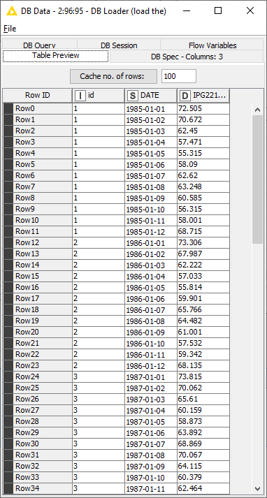

Node **Hive to Spark** digunakan untuk mengimportkan data ke dalam bentuk dataframe

Node **Hive to Spark** memerlukan 2 input, yaitu:

 - **kotak coklat** (data dari node DB Loader yang benbentuk HIVE)
 - **kotak abu-abu** (Spark context dari node Create Local Big Data Environment)

dan 1 output, yaitu:

 - **kotak hitam** (data yang telah berbentuk DataFrame/RDD)

# Evaluation
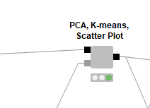

- Pada tahap Evaluasi menggunakan komponen-komponen seperti **PCA, K-means, Scatter Plot** untuk menganalisis menggunakan PCA dan K-means kemudian di plot pada tabel menggunakan Scatter Plot
- Berikut isi dari komponen **PCA, K-means, Scatter Plot** 
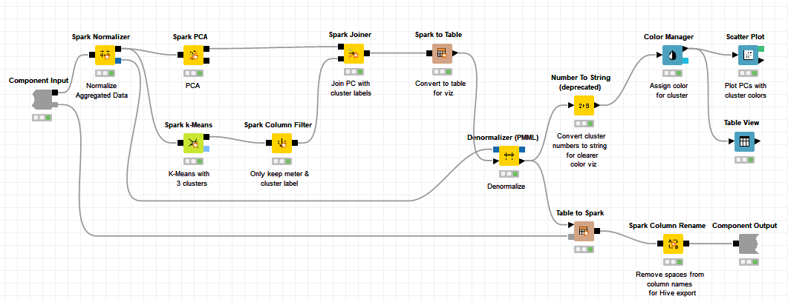

- Pertama-tama melakukan normalisasi menggunakan node **Spark Normalizer** 

- Kemundian melakukan PCA (**Principal Component Analysis**). Dikarenakan dataset berukukan kecil maka saya menggunakan 100% dari dataset 

- Beginilah hasil dari PCA yang telah dilakukan 
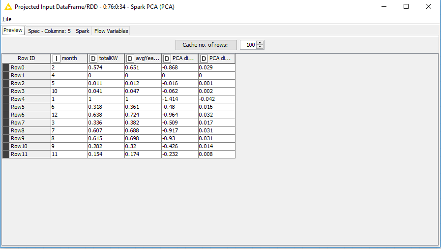

- Lalu untuk pengelompokan cluster mengunakan algoritma K-means dengan node **Spark k-Means** 

- Dan beginilah hasil dari pengelompokan K-means 

- Tambahkan column filter untuk menampilkan month dan cluster 

- Beginilah hasilnya setelah di filter 
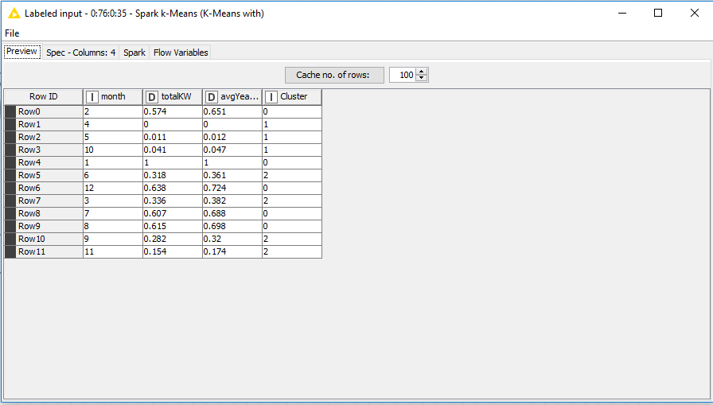

- Setelah itu tambahkan joiner seperti dengan parameter "month" 

- Dan beginilah hasil setelah menggabungkan **PCA** dan **K-Means** 
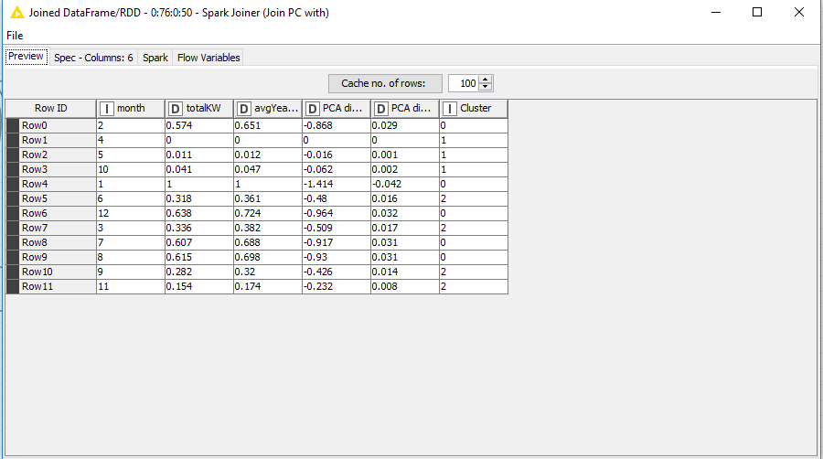

- Kemudian tambahkan node **Spark to Table** untuk mengubah data spark menjadi table
- Setelah itu lakukan denormalisasi untuk membuat table view
- Lalu tambahkan node **Number to String** untuk keperluan kustomisasi tabel dengan konfigurasi sebagai berikut 

- Beginilah hasil input untuk kustomisasi tabel 
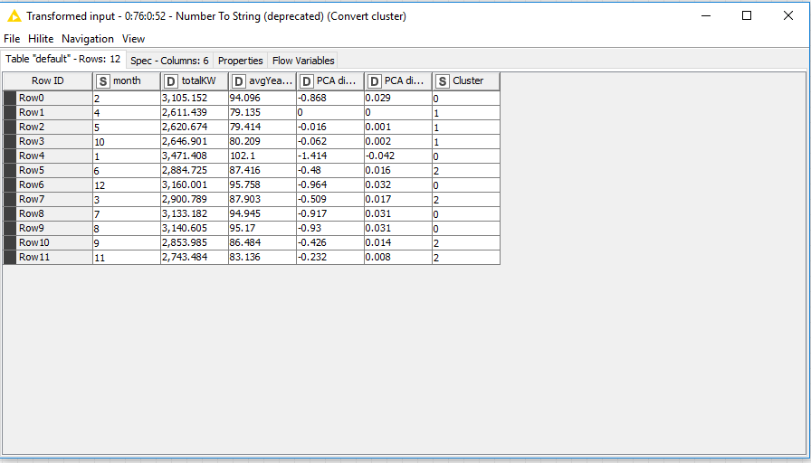

- Lalu atur warna pada cluster menggunakan node **Color Manager** 

- Beginilah hasil dari pewarnaan cluster dalam bentuk tabel 
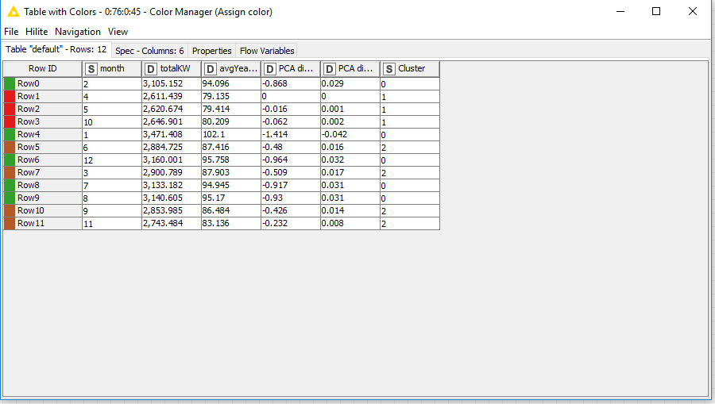

- Kemudian lakukan plotting menggunakan node **Scatter Plot** 

- Beginilah hasil dari plotting menggunakan **Scatter Plot** 

- Setelah itu membuat node **Table View** untuk membuat Aggregated Production Data 

- Dan beginilah tampilan JavaScript untuk tabel 
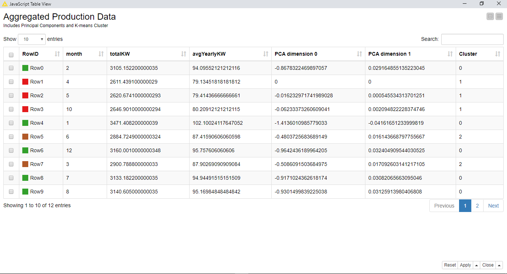

- Kemudian pada denormalisasi ubahlah menjadi spark kembali menggunakan **Table to Spark**
- Menghilangkan underscore pada PCA dimension untuk deployment menggunakan node **Spark Column Rename** 
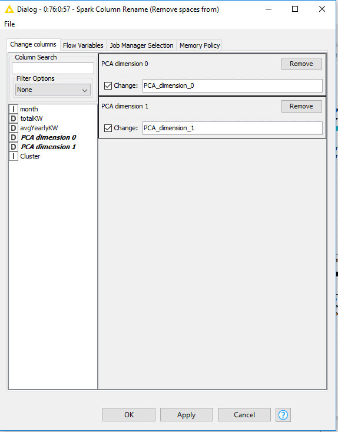

# Deployment

Untuk deployment sendiri, data dari step Evaluation akan di deploy ke dalam HIVE menggunakan **Spark to Hive** dan Parquet menggunakan **Spark to Parquet**, **Spark to Parquet** berfungsi untuk mengubah format data yang awalnya adalah **DataFrame/RDD** menjadi format **file Parquet**, Berikut merupakan konfigurasi dari **Spark to Hive** 

Tabel akan diberi nama **hasil_electric**

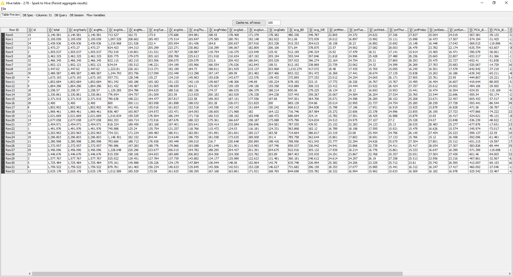

Berikut merupakankonfigurasi untuk **Spark to Parquet**

Untuk hasilnya sendiri akan disimpan pada direktori **/electric_aggs**. 
Berikut adalah hasilnya:

